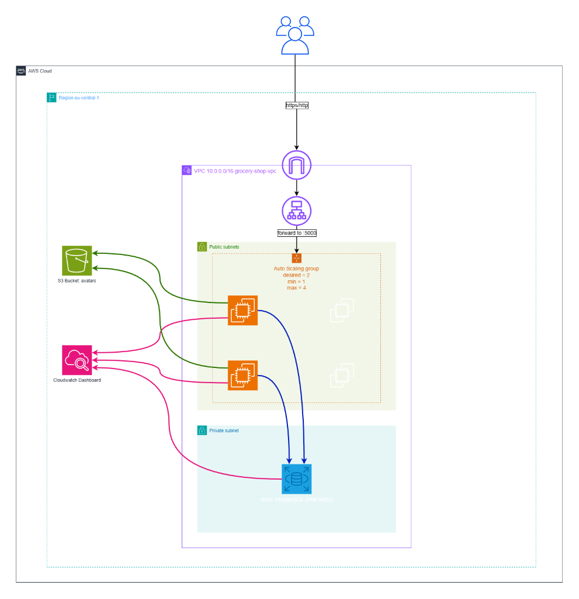

# AWS Grocery Shop Infrastructure

This directory contains the Terraform code to provision the AWS infrastructure for the Grocery Shop application.

## Prerequisites

Before you begin, ensure you have the following installed and configured:

1.  **Terraform** (v1.0+)
2.  **AWS CLI** (configured with `aws configure`)
3.  **SSH Key Pair**: You need an SSH public key file (default: `key-aws-ssh.pub`) in this directory.

## Configuration

1.  Create a `terraform.tfvars` file (or use the existing one) with the following variables:

    ```hcl
    aws_region               = "eu-central-1"
    aws_profile              = "default"
    ssh_key_pair_name        = "key-aws-ssh"       # Name of your key file (without .pub)
    s3_bucket_name           = "your-unique-bucket-name"
    grocery_db_name          = "grocerydb"
    grocery_username         = "grocery_user"
    grocery_user_db_password = "secureUserPassword123!"
    db_password              = "secureMasterPassword123!"
    ```

## Deployment Steps

1.  **Initialize Terraform**:
    ```bash
    terraform init
    ```

2.  **Review the Plan**:
    ```bash
    terraform plan
    ```

3.  **Apply the Infrastructure**:
    ```bash
    terraform apply
    ```

## Accessing the Application

After a successful deployment, Terraform will output the Load Balancer URL:

```
alb_dns_name = "http://grocery-shop-alb-..."
```

*   **Web App**: Open the `alb_dns_name` URL in your browser.
*   **Wait Time**: It may take a few minutes for the EC2 instances to launch, install Docker, and start the application.

## Application Architecture



The infrastructure consists of a high-availability architecture designed for security and scalability:

*   **Public Layer (DMZ)**: An **Application Load Balancer (ALB)** in public subnets handles all incoming HTTP traffic.
*   **Compute Layer**: An **Auto Scaling Group** manages EC2 instances. Due to specific account restrictions (SCP), these run in public subnets but are protected by Security Groups restricting access to the ALB.
*   **Data Layer**: A **PostgreSQL RDS** database resides in an isolated **Private Network** (spanning two Availability Zones), ensuring no direct internet access.
*   **Storage**: An **S3 Bucket** stores user uploads (avatars), securely accessed via IAM Roles.
*   **Monitoring**: A **CloudWatch Dashboard** provides visibility into CPU, Request Counts, and Health Status.

## Project Structure

```text
Infrastructure/
├── architecture_diagram.png  # Visual representation of the architecture
├── network.tf                # VPC, Subnets, Gateways, Route Tables
├── ec2.tf                    # Security Groups, IAM Roles, Key Pairs
├── asg.tf                    # Launch Templates, Auto Scaling Group
├── alb.tf                    # Load Balancer, Target Groups, Listeners
├── rds.tf                    # RDS Database, Subnet Groups
├── s3.tf                     # S3 Bucket, Public Access Block, Policies
├── dashboard.tf              # CloudWatch Monitoring Dashboard
├── variables.tf              # Input variable definitions
├── outputs.tf                # Output values (URL, IDs)
├── provider.tf               # AWS Provider configuration
├── userdata.sh               # Startup script for EC2 instances
├── default_user.png          # Default asset for S3
└── README.md                 # This documentation
```

## Cleaning Up

To destroy the infrastructure and stop creating costs:

```bash
terraform destroy
```
